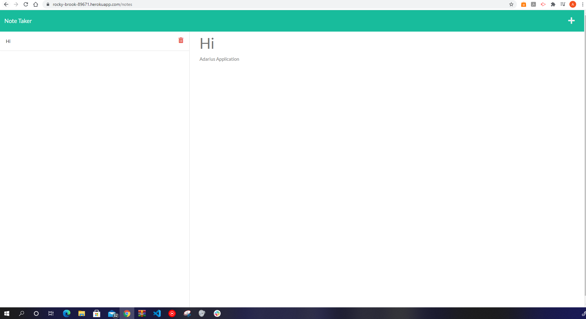

# Note Taker

## User Story

- AS A small business owner
  I WANT to be able to write and save notes
  SO THAT I can organize my thoughts and keep track of tasks I need to complete

## Acceptance Criteria

### GIVEN a note-taking application

- WHEN I open the Note Taker;
  THEN I am presented with a landing page with a link to a notes page
- WHEN I click on the link to the notes page;
  THEN I am presented with a page with existing notes listed in the left-hand column, plus empty fields to enter a new note title and the note’s text in the right-hand column
- WHEN I enter a new note title and the note’s text;
  THEN a Save icon appears in the navigation at the top of the page
- WHEN I click on the Save icon;
  THEN the new note I have entered is saved and appears in the left-hand column with the other existing notes
- WHEN I click on an existing note in the list in the left-hand column;
  THEN that note appears in the right-hand column
- WHEN I click on the Write icon in the navigation at the top of the page;
  THEN I am presented with empty fields to enter a new note title and the note’s text in the right-hand column

# Purpose

A website that able to write and save notes and to organize my thoughts and keep track of tasks I need to complete.

## Built with

- HTML
- CSS
- JavaScript
- Node
- Heroku

## Challenges

- One of my hardest challenges was trying to sync the apiRoutes with the notes.html page. It kept resulting where it will not be linked to the CSS and Index.js in the public folder.

## Website

- https://github.com/gadaell/Note-Taker

- https://rocky-brook-89671.herokuapp.com/
- https://git.heroku.com/rocky-brook-89671.git

## Contribution

Made by A'Darius (A'D) Ellis, starter code from Xandromus (Xander Rapstine) & nol166 (John McCambridge)

### ©️2021 Note-Taker
